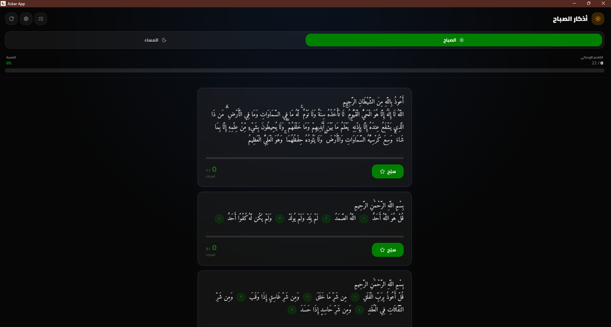
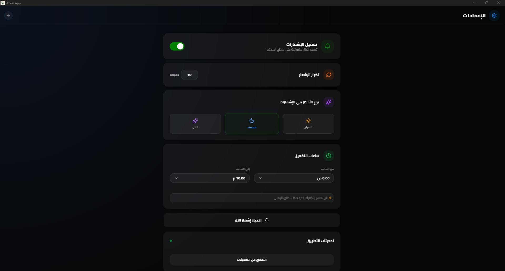
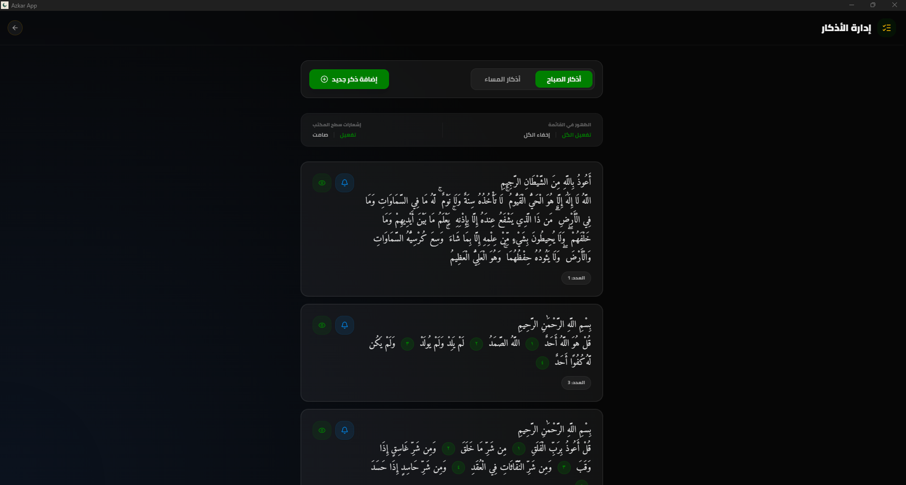
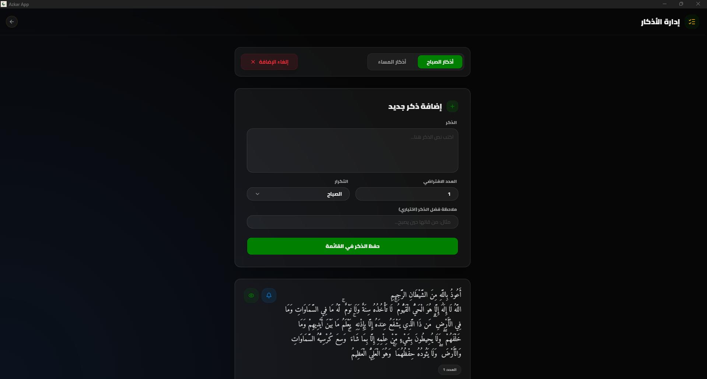
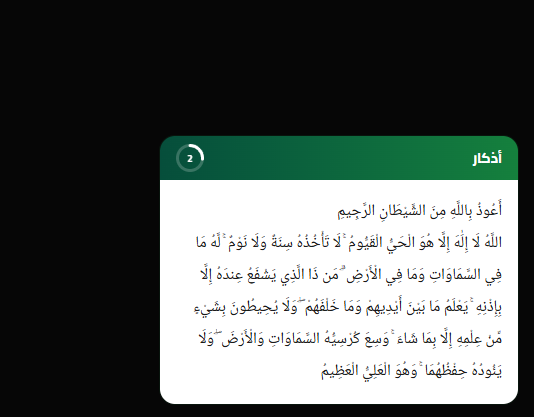

# Azkar — Daily Dhikr Notifications

A lightweight desktop reminder app for daily spiritual adhkar, designed for performance, simplicity, and native system integration.

[](https://github.com/F-47/azkar/releases)


[](https://github.com/F-47/azkar/releases)
[](LICENSE.md)

---

## Download

Get the latest version for your system:

[https://github.com/F-47/azkar/releases/latest](https://github.com/F-47/azkar/releases/latest)

Windows users: download `.msi` (recommended)
Linux users: choose `.deb`, `.rpm`, or `.AppImage`

---

## Built for all major platforms

- Windows (.msi / .exe)
- Debian / Ubuntu (.deb)
- Fedora / RHEL (.rpm)
- Any Linux distribution (.AppImage)

Each build is packaged natively for its target system to ensure proper performance, integration, and stability.

---

## Preview

<div align="center">









</div>

---

## Features

### Simple. Fast. Always running in the background.

- Cross-platform desktop support (Windows & Linux)
- Native Linux packaging (.deb, .rpm, AppImage)
- System tray background operation
- Scheduled adhkar reminders (morning & evening)
- Native desktop notifications
- Clean glassmorphic UI with light/dark mode
- Configurable active hours (no interruptions)
- Automatic updates via Tauri updater
- Lightweight memory footprint

---

## Tech Stack

| Layer    | Technology                    |
| -------- | ----------------------------- |
| Core     | Tauri v2                      |
| Frontend | Next.js 16, React 19          |
| Styling  | Tailwind CSS 4, Framer Motion |

---

## Installation

### Windows

- Download `.msi`
- Run installer
- Launch from Start Menu

---

### Debian / Ubuntu

```bash id="apt-install"
sudo apt install azkar
```

Or manual install:

```bash id="deb-install"
sudo dpkg -i azkar.deb
sudo apt-get install -f
```

---

### Fedora / RHEL

```bash id="rpm-install"
sudo rpm -i azkar.rpm
```

---

### Arch Linux (AUR)

```bash id="aur-install"
yay -S azkar
```

---

### Universal Linux (AppImage)

```bash id="appimage"
chmod +x Azkar.AppImage
./Azkar.AppImage
```

---

## Changelog

All updates are tracked in [`CHANGELOG.md`](CHANGELOG.md)

Latest releases:
[https://github.com/F-47/azkar/releases](https://github.com/F-47/azkar/releases)

---

## Development

### Requirements

- Node.js 20+
- Rust (stable toolchain)

### Setup

```bash id="setup"
npm install
```

### Run

```bash id="dev"
npm run dev
```

### Build

```bash id="build"
npm run build
```

---

## License

MIT License — see `LICENSE.md`
